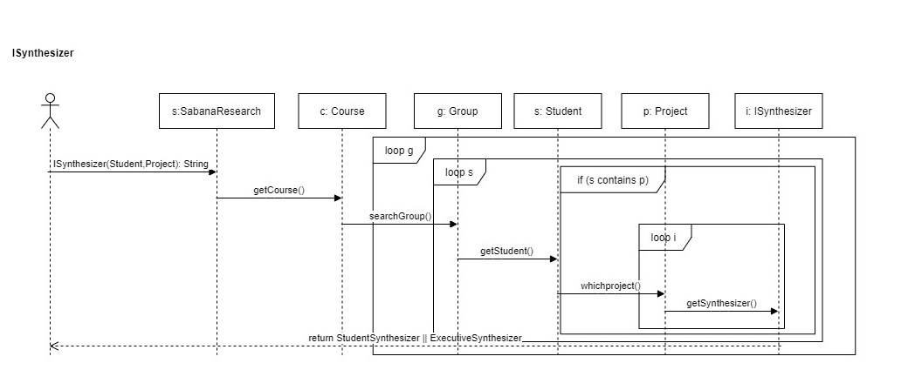
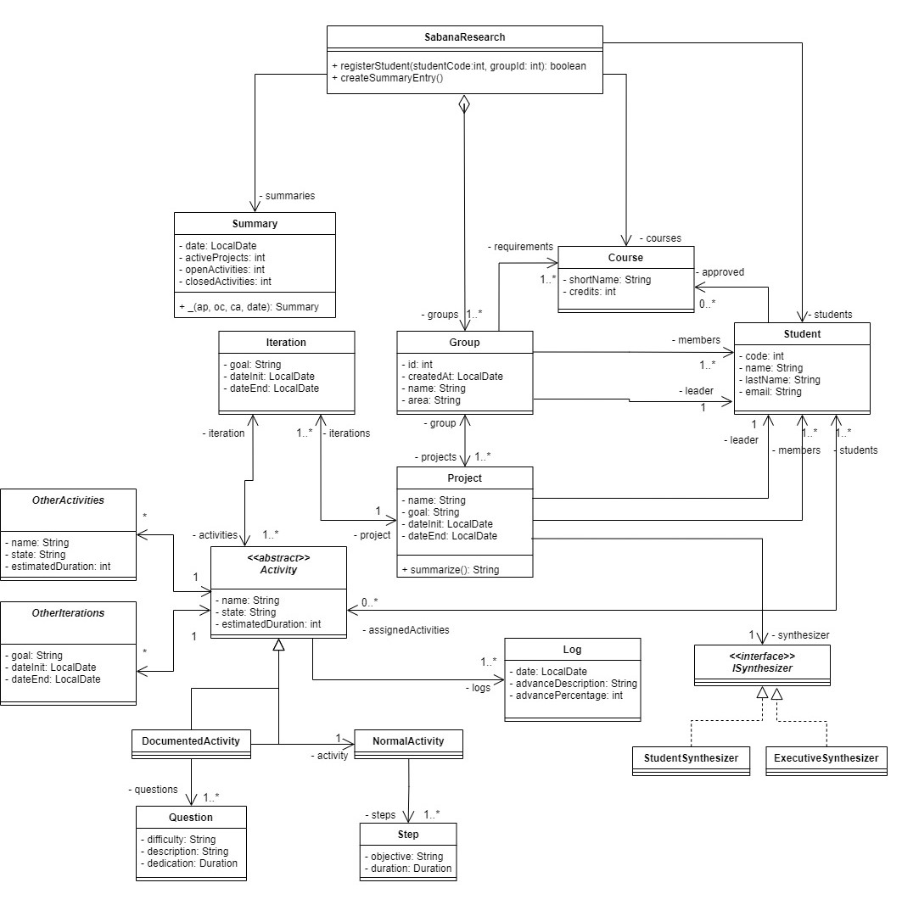

**I. Conceptos** 
1.	¿Cuáles son las acciones los tres momentos importantes de las excepciones? ¿Cuál es el objetivo de cada una? ¿Cómo se implementa en Java cada acción?
Los tres momentos importantes en las excepciones son el throw, try y catch, básicamente a lo que se refieren es a lanzar, probar y atrapar las excepciones a lo largo del desarrollo del programa. En primer lugar está el throw, se utiliza para cuando el resultado no es el esperado, por ejemplo la edad tiene que ser mayor o igual que cero, si no es así se lanza una excepción diciendo que la edad debe de ser positiva. Después está try y catch, se consideran como un bloque de código, en el try puede haber una o más sentencias que indiquen lo que se está desarrollando en el programa, mientras que el catch se puede decir que se muestra el resultado de ese desarrollo, siempre teniendo en cuenta que esto con el fin de mostrar la función de la excepción.
Throw: Un ejemplo puede ser, public static void multiplicar() throw GeometricException, así se invoca a la excepción y luego se muestra su resultado o el por qué pasa.
Try y Catch: Se declara una variable, se utiliza try, dentro de esta se escribe un método, se suele mencionar a que se quiere igualar la variable y en el catch se suele hacer System.out.println(), dentro se pone el resultado. 
2.  ¿Qué es sobre-escritura de métodos? ¿Por qué aplicarla? ¿Cómo impedir que se sobre-escriba un método?.
El override es la manera en la que una clase hija puede redefinir los métodos heredados de la Super clase, se puede utilizar cuando se requiere el mismo método, pero los datos que se vayan a poner dentro de él son distintos a la clase original. Para impedir que se pueda sobre-escribir un método se puede de dos formas, cambiando desde un principio el modificar de acceso o lanzar excepciones para indicar que algo no está de la manera indicada. 

**II. Diseñando** 
1. El método ISummarize, contiene dos sintetizadores, ambos sirven para hallar información del estudiante ya sea de su nombre o de la duración que ha estado en cierto proyecto.
Public void Isummarize(Student,Project)
   
2. Diagrama de secuencia: 

  
   
3. Diagrama de clases:

4. public void searchGroup(), public String whichproject(), public void getSynthesizer()

**III. EXTENDIENDO**
1.

